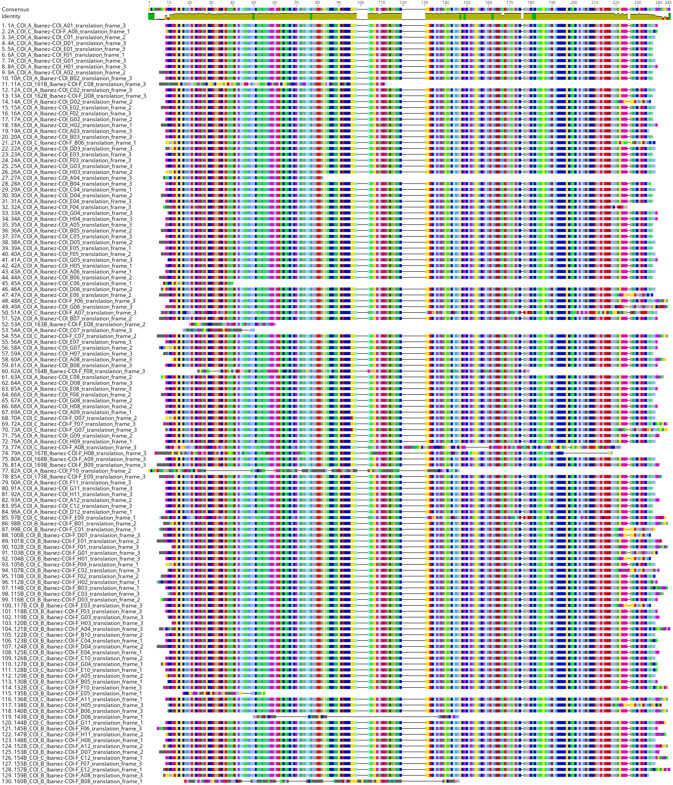
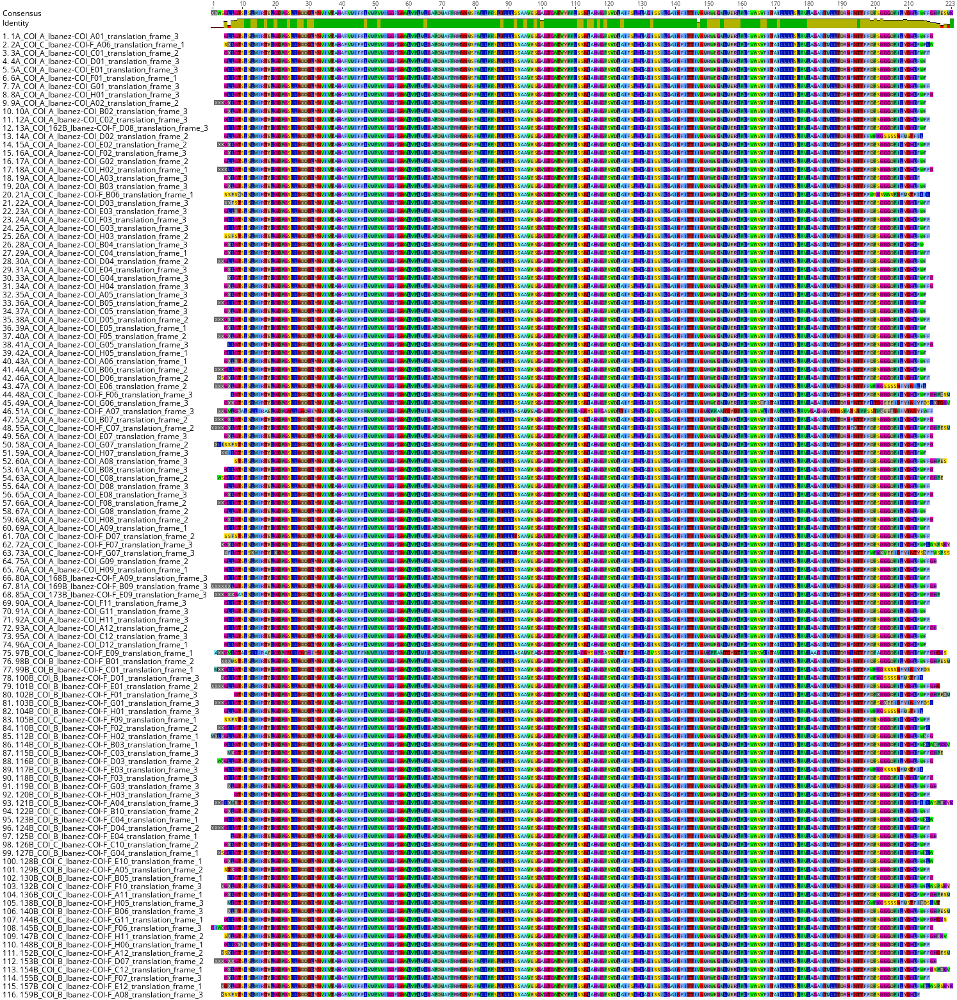
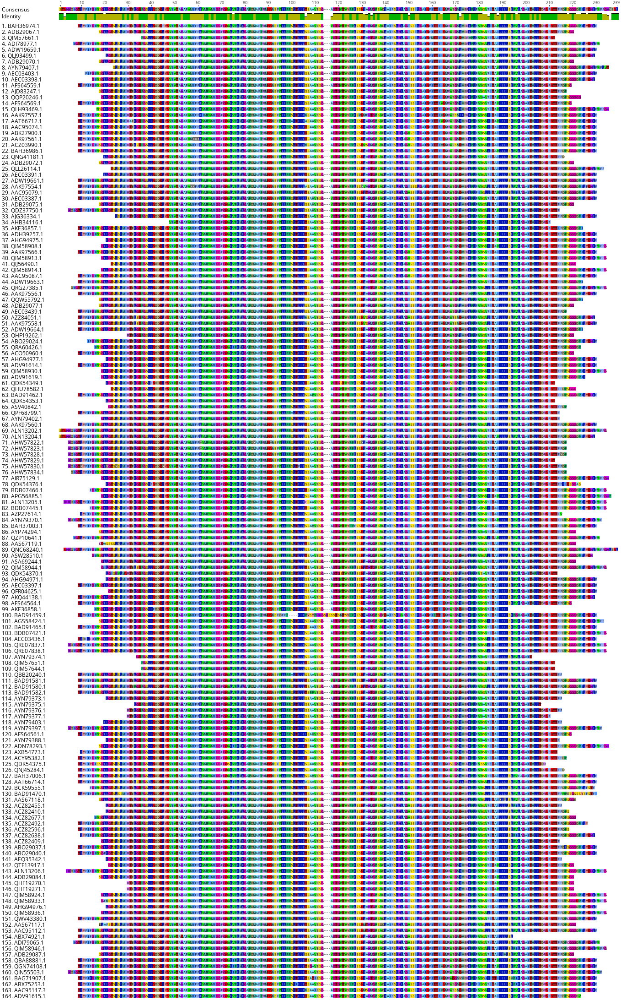
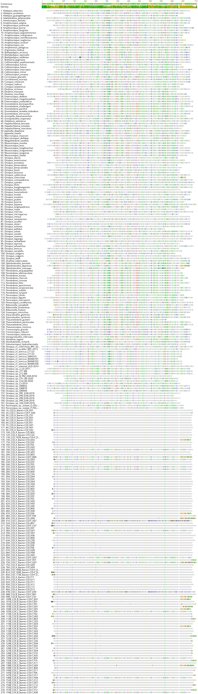
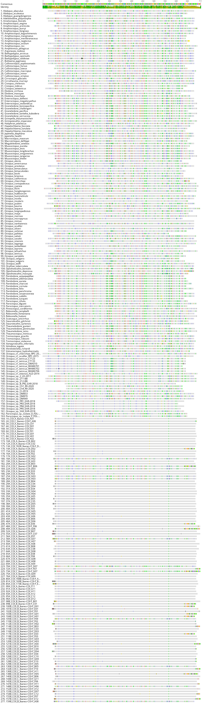
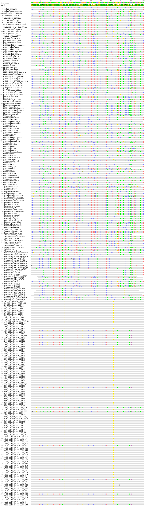
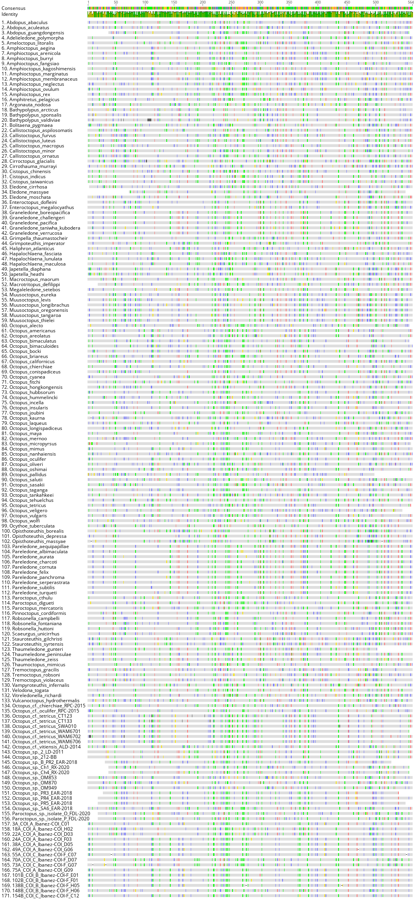
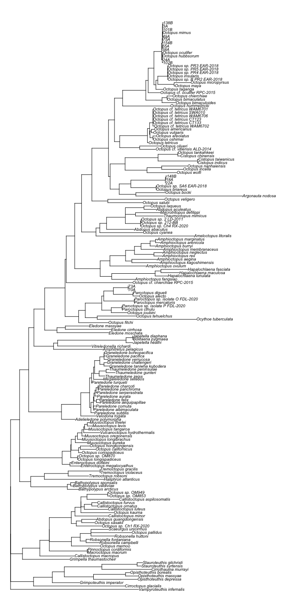
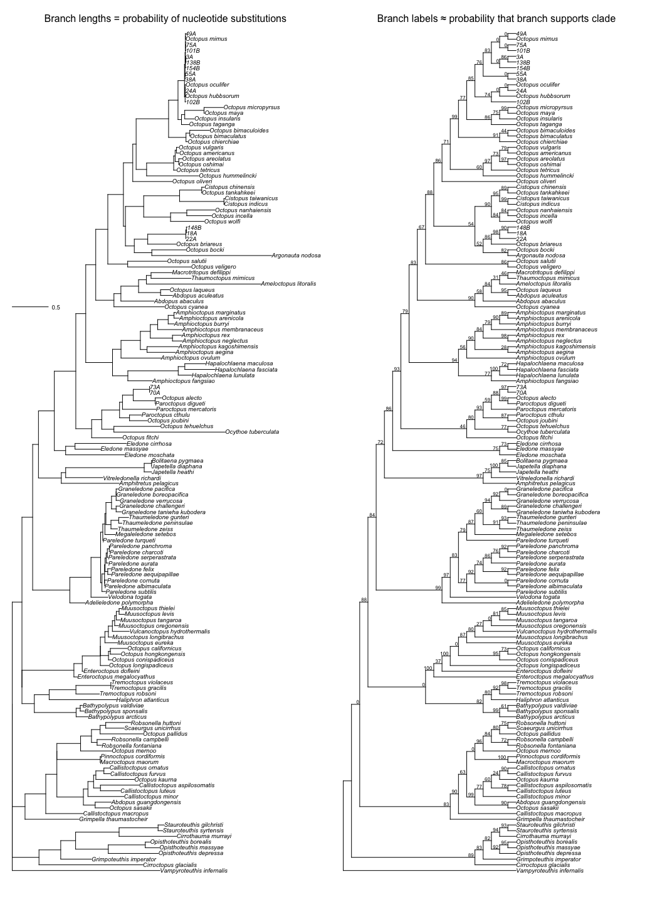
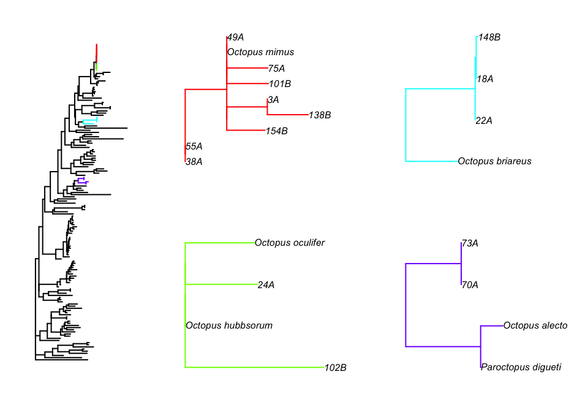

DNA Barcoding Paralarval Octopus of the Galápagos Islands
================
Tyler McCraney
2022-05-10

### Overview

Juvenile *Octopus* were collected with light traps. DNA was extracted
from samples using Qiagen DNeasy, a fragment of the mitochondrial COI
gene was amplified with universal *Octopus* primers
**COI_Ibanez-Folmer_F** and **COI_Ibanez-Folmer_R**, and COI amplicons
were sequenced using the forward primer only.

The barcoding analysis below has 4 main parts: (1) process the
experimental sequences, (2) collect and process the baseline sequences,
(3) process the combined experimental-baseline sequences, and (4) infer
a phylogenetic tree and statistical support for assigning taxonomy to
the unknown *Octopus* samples.

While this 4-part analysis seems daunting, the sequence processing in
each part follows a general format of (1) multiple sequence alignment
(MSA) with MAFFT, (2) visual inspection of MSA with Geneious, (3)
pruning spurious sequences with trimAl, and (4) repeat step 2.

MAFFT, trimAl, and RAxML are free software, and can be installed using
Anaconda on MacOS, Windows, and LinuxOS. Geneious is not free software,
but it can be downloaded for free and used to view MSA’s, translate
sequences, and extract subsequences without purchasing a license.

------------------------------------------------------------------------

## Process experimental sequences

Let’s quality-trim the raw sequences using the custom Python program
below. Alternatively, quality-trimming could be done manually (and
safely) in Geneious by importing the `*.ab1` file, visually inspecting
the electropherogram, highlighting the “good” portion of the sequence,
and extracting the highlighted “good” portion to a new file. I do not
recommend manual quality-trimming via direct editing of text files;
including single base call edits and deleting beginning/ending “garbage”
bases (I learned this lesson the hard way, lol)

``` python
#!/usr/bin/python3

from Bio import SeqIO

import glob
import re
import os

# make directory to send quality-trimmed fasta files
os.system("mkdir quality-trimmed")

def abi_trim_to_fasta( slice = 1539 ): # function to process multiple sequences
    abi_files = glob.glob("*.ab1") # Create list of .ab1 files
    for abi_file in abi_files:
        sample_name = abi_file.replace(".ab1", "")
        trimmed = SeqIO.read(abi_file, "abi-trim")
        trimmed.id = trimmed.name
        outfile = SeqIO.write(trimmed[0:slice], "quality-trimmed/" + sample_name + ".fasta", "fasta-2line")
    print(str(len(abi_files)) + " DNA sequences quality-trimmed with Mott's algorithm and sliced at " + str(slice) + " bp")

abi_trim_to_fasta() # Call function

# Description of Mott's algorithm for leading/trailing sequence trimming
# (from the phred user manual... the options below are meaningless)
# The modified Mott trimming algorithm, which is used to calculate the
# trimming information for the '-trim_alt' option and the phd files,
# uses base error probabilities calculated from the phred quality
# values. For each base it subtracts the base error probability from an
# error probability cutoff value (0.05 by default, and changed using
# the '-trim_cutoff' option) to form the base score. Then it finds the
# highest scoring segment of the sequence where the segment score is
# the sum of the segment base scores (the score can have non-negative
# values only). The algorithm requires a minimum segment length, which
# is set to 20 bases.

# Tyler McCraney
# Humboldt State University
# August 24, 2021
```

We run the Python quality-trimming program from the command line as
follows:

``` bash
python ~/COI_octo_mas1/abi-trim_to_fasta.py
```

Let’s concatenate the quality-trimmed sequences to a monolithic FASTA in
numerical order. Alternatively, this could be done with
`cat ~/COI_octo_mas1/quality-trimmed/*.fasta > ~/COI_octo_mas1/quality-trimmed/DNA.fasta`,
but that would result in computer ordered samples (e.g., 100 10 1 200 20
2 …), which can be confusing.

``` bash
cat \
~/COI_octo_mas1/quality-trimmed/1A_COI_A_Ibanez-COI_A01.fasta \
~/COI_octo_mas1/quality-trimmed/2A_COI_C_Ibanez-COI-F_A06.fasta \
~/COI_octo_mas1/quality-trimmed/3A_COI_A_Ibanez-COI_C01.fasta \
~/COI_octo_mas1/quality-trimmed/4A_COI_A_Ibanez-COI_D01.fasta \
~/COI_octo_mas1/quality-trimmed/5A_COI_A_Ibanez-COI_E01.fasta \
~/COI_octo_mas1/quality-trimmed/6A_COI_A_Ibanez-COI_F01.fasta \
~/COI_octo_mas1/quality-trimmed/7A_COI_A_Ibanez-COI_G01.fasta \
~/COI_octo_mas1/quality-trimmed/8A_COI_A_Ibanez-COI_H01.fasta \
~/COI_octo_mas1/quality-trimmed/9A_COI_A_Ibanez-COI_A02.fasta \
~/COI_octo_mas1/quality-trimmed/10A_COI_A_Ibanez-COI_B02.fasta \
~/COI_octo_mas1/quality-trimmed/11A_COI_161B_Ibanez-COI-F_C08.fasta \
~/COI_octo_mas1/quality-trimmed/12A_COI_A_Ibanez-COI_C02.fasta \
~/COI_octo_mas1/quality-trimmed/13A_COI_162B_Ibanez-COI-F_D08.fasta \
~/COI_octo_mas1/quality-trimmed/14A_COI_A_Ibanez-COI_D02.fasta \
~/COI_octo_mas1/quality-trimmed/15A_COI_A_Ibanez-COI_E02.fasta \
~/COI_octo_mas1/quality-trimmed/16A_COI_A_Ibanez-COI_F02.fasta \
~/COI_octo_mas1/quality-trimmed/17A_COI_A_Ibanez-COI_G02.fasta \
~/COI_octo_mas1/quality-trimmed/18A_COI_A_Ibanez-COI_H02.fasta \
~/COI_octo_mas1/quality-trimmed/19A_COI_A_Ibanez-COI_A03.fasta \
~/COI_octo_mas1/quality-trimmed/20A_COI_A_Ibanez-COI_B03.fasta \
~/COI_octo_mas1/quality-trimmed/21A_COI_C_Ibanez-COI-F_B06.fasta \
~/COI_octo_mas1/quality-trimmed/22A_COI_A_Ibanez-COI_D03.fasta \
~/COI_octo_mas1/quality-trimmed/23A_COI_A_Ibanez-COI_E03.fasta \
~/COI_octo_mas1/quality-trimmed/24A_COI_A_Ibanez-COI_F03.fasta \
~/COI_octo_mas1/quality-trimmed/25A_COI_A_Ibanez-COI_G03.fasta \
~/COI_octo_mas1/quality-trimmed/26A_COI_A_Ibanez-COI_H03.fasta \
~/COI_octo_mas1/quality-trimmed/27A_COI_A_Ibanez-COI_A04.fasta \
~/COI_octo_mas1/quality-trimmed/28A_COI_A_Ibanez-COI_B04.fasta \
~/COI_octo_mas1/quality-trimmed/29A_COI_A_Ibanez-COI_C04.fasta \
~/COI_octo_mas1/quality-trimmed/30A_COI_A_Ibanez-COI_D04.fasta \
~/COI_octo_mas1/quality-trimmed/31A_COI_A_Ibanez-COI_E04.fasta \
~/COI_octo_mas1/quality-trimmed/32A_COI_A_Ibanez-COI_F04.fasta \
~/COI_octo_mas1/quality-trimmed/33A_COI_A_Ibanez-COI_G04.fasta \
~/COI_octo_mas1/quality-trimmed/34A_COI_A_Ibanez-COI_H04.fasta \
~/COI_octo_mas1/quality-trimmed/35A_COI_A_Ibanez-COI_A05.fasta \
~/COI_octo_mas1/quality-trimmed/36A_COI_A_Ibanez-COI_B05.fasta \
~/COI_octo_mas1/quality-trimmed/37A_COI_A_Ibanez-COI_C05.fasta \
~/COI_octo_mas1/quality-trimmed/38A_COI_A_Ibanez-COI_D05.fasta \
~/COI_octo_mas1/quality-trimmed/39A_COI_A_Ibanez-COI_E05.fasta \
~/COI_octo_mas1/quality-trimmed/40A_COI_A_Ibanez-COI_F05.fasta \
~/COI_octo_mas1/quality-trimmed/41A_COI_A_Ibanez-COI_G05.fasta \
~/COI_octo_mas1/quality-trimmed/42A_COI_A_Ibanez-COI_H05.fasta \
~/COI_octo_mas1/quality-trimmed/43A_COI_A_Ibanez-COI_A06.fasta \
~/COI_octo_mas1/quality-trimmed/44A_COI_A_Ibanez-COI_B06.fasta \
~/COI_octo_mas1/quality-trimmed/45A_COI_A_Ibanez-COI_C06.fasta \
~/COI_octo_mas1/quality-trimmed/46A_COI_A_Ibanez-COI_D06.fasta \
~/COI_octo_mas1/quality-trimmed/47A_COI_A_Ibanez-COI_E06.fasta \
~/COI_octo_mas1/quality-trimmed/48A_COI_C_Ibanez-COI-F_F06.fasta \
~/COI_octo_mas1/quality-trimmed/49A_COI_A_Ibanez-COI_G06.fasta \
~/COI_octo_mas1/quality-trimmed/50A_COI_A_Ibanez-COI_H06.fasta \
~/COI_octo_mas1/quality-trimmed/51A_COI_C_Ibanez-COI-F_A07.fasta \
~/COI_octo_mas1/quality-trimmed/52A_COI_A_Ibanez-COI_B07.fasta \
~/COI_octo_mas1/quality-trimmed/53A_COI_163B_Ibanez-COI-F_E08.fasta \
~/COI_octo_mas1/quality-trimmed/54A_COI_A_Ibanez-COI_C07.fasta \
~/COI_octo_mas1/quality-trimmed/55A_COI_C_Ibanez-COI-F_C07.fasta \
~/COI_octo_mas1/quality-trimmed/56A_COI_A_Ibanez-COI_E07.fasta \
~/COI_octo_mas1/quality-trimmed/57A_COI_A_Ibanez-COI_F07.fasta \
~/COI_octo_mas1/quality-trimmed/58A_COI_A_Ibanez-COI_G07.fasta \
~/COI_octo_mas1/quality-trimmed/59A_COI_A_Ibanez-COI_H07.fasta \
~/COI_octo_mas1/quality-trimmed/60A_COI_A_Ibanez-COI_A08.fasta \
~/COI_octo_mas1/quality-trimmed/61A_COI_A_Ibanez-COI_B08.fasta \
~/COI_octo_mas1/quality-trimmed/62A_COI_164B_Ibanez-COI-F_F08.fasta \
~/COI_octo_mas1/quality-trimmed/63A_COI_A_Ibanez-COI_C08.fasta \
~/COI_octo_mas1/quality-trimmed/64A_COI_A_Ibanez-COI_D08.fasta \
~/COI_octo_mas1/quality-trimmed/65A_COI_A_Ibanez-COI_E08.fasta \
~/COI_octo_mas1/quality-trimmed/66A_COI_A_Ibanez-COI_F08.fasta \
~/COI_octo_mas1/quality-trimmed/67A_COI_A_Ibanez-COI_G08.fasta \
~/COI_octo_mas1/quality-trimmed/68A_COI_A_Ibanez-COI_H08.fasta \
~/COI_octo_mas1/quality-trimmed/69A_COI_A_Ibanez-COI_A09.fasta \
~/COI_octo_mas1/quality-trimmed/70A_COI_C_Ibanez-COI-F_D07.fasta \
~/COI_octo_mas1/quality-trimmed/71A_COI_A_Ibanez-COI_C09.fasta \
~/COI_octo_mas1/quality-trimmed/72A_COI_C_Ibanez-COI-F_F07.fasta \
~/COI_octo_mas1/quality-trimmed/73A_COI_C_Ibanez-COI-F_G07.fasta \
~/COI_octo_mas1/quality-trimmed/74A_COI_A_Ibanez-COI_F09.fasta \
~/COI_octo_mas1/quality-trimmed/75A_COI_A_Ibanez-COI_G09.fasta \
~/COI_octo_mas1/quality-trimmed/76A_COI_A_Ibanez-COI_H09.fasta \
~/COI_octo_mas1/quality-trimmed/77A_COI_C_Ibanez-COI-F_A08.fasta \
~/COI_octo_mas1/quality-trimmed/78A_COI_A_Ibanez-COI_B10.fasta \
~/COI_octo_mas1/quality-trimmed/79A_COI_167B_Ibanez-COI-F_H08.fasta \
~/COI_octo_mas1/quality-trimmed/80A_COI_168B_Ibanez-COI-F_A09.fasta \
~/COI_octo_mas1/quality-trimmed/81A_COI_169B_Ibanez-COI-F_B09.fasta \
~/COI_octo_mas1/quality-trimmed/82A_COI_A_Ibanez-COI_F10.fasta \
~/COI_octo_mas1/quality-trimmed/83A_COI_171B_Ibanez-COI-F_C09.fasta \
~/COI_octo_mas1/quality-trimmed/84A_COI_172B_Ibanez-COI-F_D09.fasta \
~/COI_octo_mas1/quality-trimmed/85A_COI_173B_Ibanez-COI-F_E09.fasta \
~/COI_octo_mas1/quality-trimmed/86A_COI_174B_Ibanez-COI-F_F09.fasta \
~/COI_octo_mas1/quality-trimmed/87A_COI_175B_Ibanez-COI-F_G09.fasta \
~/COI_octo_mas1/quality-trimmed/88A_COI_176B_Ibanez-COI-F_H09.fasta \
~/COI_octo_mas1/quality-trimmed/89A_COI_A_Ibanez-COI_E11.fasta \
~/COI_octo_mas1/quality-trimmed/90A_COI_A_Ibanez-COI_F11.fasta \
~/COI_octo_mas1/quality-trimmed/91A_COI_A_Ibanez-COI_G11.fasta \
~/COI_octo_mas1/quality-trimmed/92A_COI_A_Ibanez-COI_H11.fasta \
~/COI_octo_mas1/quality-trimmed/93A_COI_A_Ibanez-COI_A12.fasta \
~/COI_octo_mas1/quality-trimmed/94A_COI_A_Ibanez-COI_B12.fasta \
~/COI_octo_mas1/quality-trimmed/95A_COI_A_Ibanez-COI_C12.fasta \
~/COI_octo_mas1/quality-trimmed/96A_COI_A_Ibanez-COI_D12.fasta \
~/COI_octo_mas1/quality-trimmed/97B_COI_C_Ibanez-COI-F_E09.fasta \
~/COI_octo_mas1/quality-trimmed/98B_COI_B_Ibanez-COI-F_B01.fasta \
~/COI_octo_mas1/quality-trimmed/99B_COI_B_Ibanez-COI-F_C01.fasta \
~/COI_octo_mas1/quality-trimmed/100B_COI_B_Ibanez-COI-F_D01.fasta \
~/COI_octo_mas1/quality-trimmed/101B_COI_B_Ibanez-COI-F_E01.fasta \
~/COI_octo_mas1/quality-trimmed/102B_COI_B_Ibanez-COI-F_F01.fasta \
~/COI_octo_mas1/quality-trimmed/103B_COI_B_Ibanez-COI-F_G01.fasta \
~/COI_octo_mas1/quality-trimmed/104B_COI_B_Ibanez-COI-F_H01.fasta \
~/COI_octo_mas1/quality-trimmed/105B_COI_C_Ibanez-COI-F_F09.fasta \
~/COI_octo_mas1/quality-trimmed/106B_COI_B_Ibanez-COI-F_B02.fasta \
~/COI_octo_mas1/quality-trimmed/107B_COI_B_Ibanez-COI-F_C02.fasta \
~/COI_octo_mas1/quality-trimmed/108B_COI_B_Ibanez-COI-F_D02.fasta \
~/COI_octo_mas1/quality-trimmed/109B_COI_B_Ibanez-COI-F_E02.fasta \
~/COI_octo_mas1/quality-trimmed/110B_COI_B_Ibanez-COI-F_F02.fasta \
~/COI_octo_mas1/quality-trimmed/111B_COI_C_Ibanez-COI-F_H09.fasta \
~/COI_octo_mas1/quality-trimmed/112B_COI_B_Ibanez-COI-F_H02.fasta \
~/COI_octo_mas1/quality-trimmed/113B_COI_B_Ibanez-COI-F_A03.fasta \
~/COI_octo_mas1/quality-trimmed/114B_COI_B_Ibanez-COI-F_B03.fasta \
~/COI_octo_mas1/quality-trimmed/115B_COI_B_Ibanez-COI-F_C03.fasta \
~/COI_octo_mas1/quality-trimmed/116B_COI_B_Ibanez-COI-F_D03.fasta \
~/COI_octo_mas1/quality-trimmed/117B_COI_B_Ibanez-COI-F_E03.fasta \
~/COI_octo_mas1/quality-trimmed/118B_COI_B_Ibanez-COI-F_F03.fasta \
~/COI_octo_mas1/quality-trimmed/119B_COI_B_Ibanez-COI-F_G03.fasta \
~/COI_octo_mas1/quality-trimmed/120B_COI_B_Ibanez-COI-F_H03.fasta \
~/COI_octo_mas1/quality-trimmed/121B_COI_B_Ibanez-COI-F_A04.fasta \
~/COI_octo_mas1/quality-trimmed/122B_COI_C_Ibanez-COI-F_B10.fasta \
~/COI_octo_mas1/quality-trimmed/123B_COI_B_Ibanez-COI-F_C04.fasta \
~/COI_octo_mas1/quality-trimmed/124B_COI_B_Ibanez-COI-F_D04.fasta \
~/COI_octo_mas1/quality-trimmed/125B_COI_B_Ibanez-COI-F_E04.fasta \
~/COI_octo_mas1/quality-trimmed/126B_COI_C_Ibanez-COI-F_C10.fasta \
~/COI_octo_mas1/quality-trimmed/127B_COI_B_Ibanez-COI-F_G04.fasta \
~/COI_octo_mas1/quality-trimmed/128B_COI_C_Ibanez-COI-F_E10.fasta \
~/COI_octo_mas1/quality-trimmed/129B_COI_B_Ibanez-COI-F_A05.fasta \
~/COI_octo_mas1/quality-trimmed/130B_COI_B_Ibanez-COI-F_B05.fasta \
~/COI_octo_mas1/quality-trimmed/132B_COI_C_Ibanez-COI-F_F10.fasta \
~/COI_octo_mas1/quality-trimmed/134B_COI_C_Ibanez-COI-F_G10.fasta \
~/COI_octo_mas1/quality-trimmed/135B_COI_B_Ibanez-COI-F_E05.fasta \
~/COI_octo_mas1/quality-trimmed/136B_COI_C_Ibanez-COI-F_A11.fasta \
~/COI_octo_mas1/quality-trimmed/137B_COI_B_Ibanez-COI-F_G05.fasta \
~/COI_octo_mas1/quality-trimmed/138B_COI_B_Ibanez-COI-F_H05.fasta \
~/COI_octo_mas1/quality-trimmed/139B_COI_B_Ibanez-COI-F_A06.fasta \
~/COI_octo_mas1/quality-trimmed/140B_COI_B_Ibanez-COI-F_B06.fasta \
~/COI_octo_mas1/quality-trimmed/141B_COI_B_Ibanez-COI-F_C06.fasta \
~/COI_octo_mas1/quality-trimmed/143B_COI_B_Ibanez-COI-F_D06.fasta \
~/COI_octo_mas1/quality-trimmed/144B_COI_C_Ibanez-COI-F_G11.fasta \
~/COI_octo_mas1/quality-trimmed/145B_COI_B_Ibanez-COI-F_F06.fasta \
~/COI_octo_mas1/quality-trimmed/147B_COI_C_Ibanez-COI-F_H11.fasta \
~/COI_octo_mas1/quality-trimmed/148B_COI_B_Ibanez-COI-F_H06.fasta \
~/COI_octo_mas1/quality-trimmed/149B_COI_B_Ibanez-COI-F_A07.fasta \
~/COI_octo_mas1/quality-trimmed/151B_COI_B_Ibanez-COI-F_B07.fasta \
~/COI_octo_mas1/quality-trimmed/152B_COI_C_Ibanez-COI-F_A12.fasta \
~/COI_octo_mas1/quality-trimmed/153B_COI_B_Ibanez-COI-F_D07.fasta \
~/COI_octo_mas1/quality-trimmed/154B_COI_C_Ibanez-COI-F_C12.fasta \
~/COI_octo_mas1/quality-trimmed/155B_COI_B_Ibanez-COI-F_F07.fasta \
~/COI_octo_mas1/quality-trimmed/156B_COI_C_Ibanez-COI-F_D12.fasta \
~/COI_octo_mas1/quality-trimmed/157B_COI_C_Ibanez-COI-F_E12.fasta \
~/COI_octo_mas1/quality-trimmed/159B_COI_B_Ibanez-COI-F_A08.fasta \
~/COI_octo_mas1/quality-trimmed/160B_COI_B_Ibanez-COI-F_B08.fasta \
> ~/COI_octo_mas1/quality-trimmed/DNA.fasta
```

Now we need to import the monolithic FASTA of quality-trimmed sequences
into Geneious (I usually drag-and-drop the file from the Finder window
into Geneious). Once in the Geneious app, we will select each sequence
individually and use the translate function with the correct genetic
code (i.e., invertebrate mitochondrial) and all possible translation
frames: 1-fwd, 1-rev, 2-fwd, 2-rev, 3-fwd, and 3-rev. After translating
all possible frames, we inspect each translation for stop codons,
denoted by `*`.

There should be only one **fwd** translation frame that results in a AA
sequence without any stop codons. But when universal primers are used
for PCR and Sanger sequencing of marine invertebrates, don’t be
surprised by the presence of sneaky paralogous pseudogenes, which are
detected by the presence of one or more stop codons in the open reading
frame (ORF). Once we find the correct translation frame and verify ORF,
we can delete all other translation frames. We end up with a single
translation from each “good” sequence, and no translation from any
“evil” pseudogene sequences. I saved the “good” AA sequences to a
monolithic FASTA by selecting them all and clicking export in Geneious.
the “good” AA sequences were saved in this file:
`~/COI_octo_mas1/quality-trimmed/AA.fasta`.

Now lets align the AA sequences using the local-pairwise algorithm in
MAFFT as follows:

``` bash
mafft \
--maxiterate 1000 \
--localpair \
~/COI_octo_mas1/quality-trimmed/AA.fasta \
> ~/COI_octo_mas1/quality-trimmed/AA_msa.fasta
```

Next we inspect the MSA in Geneious. The image below was created in
Geneious by saving an alignment view as PNG.



We see most of the protein sequences are aligned nicely without many AA
substitutions. However, there are several short or weird looking
sequences that are causing gaps in the MSA… we call those *spurious*
sequences. Let’s use the MSA trimming app **trimAl** to prune those
spurious sequences from our MSA. IMPORTANT: trimAl indexes sequences
starting at 0, so sequence \#11 in the Geneious view above is considered
sequence \#10 in trimAl.

``` bash
trimal \
-in ~/COI_octo_mas1/quality-trimmed/AA_msa.fasta \
-out ~/COI_octo_mas1/quality-trimmed/AA_msa_pruned.fasta \
-selectseqs \{ 10,26,31,44,51,52,59,72,73,76,93,114,118,129 \}
```

Now let’s inspect the pruned alignment in Geneious.



Wow! This MSA is looking so much better after pruning those spurious
sequences. Note the Consensus sequence on top and the Identity graphic
below it. The Consensus is majority rule, so the most common AA residue
at each position is displayed. The identity graphic indicates whether
the AA residue in the consensus above is totally conserved (green) or
polymorphic (yellow). Let’s extract a sub-sequence of the consensus with
Geneious, starting with the first conserved AA position 11, and ending
with the last conserved AA position 195. We then export the consensus
sub-sequence to the file: `AA_cons.fasta`

## Collect and process baseline sequences

We have a 185 AA consensus sequence representing the most common AA
residues in our experimental dataset (`AA_cons.fasta`). Now we go to
NCBI and upload `AA_cons.fasta` to the protein-protein BLASTP tool. We
select a target taxon **Octopodiformes**, and increase the returned hits
from 500 (default) to 1000. After running BLASTP we parse the hits and
select a single hit from each taxon. Typically we should avoid selecting
ambiguously-identified taxa (e.g., “sp.”, “cf.”) as baseline data, but
in this case we are including ambiguous taxa in the genera *Octopus* and
*Paroctopus*, because our preliminary analyses indicated some
experimental sequences did not match any valid Octopodiform taxa.

After we parse the BLASTP hits and select baseline sequences, we
download the selections in monolithic FASTA (`seqdump.txt`) and GenBank
flatfile (`sequence.gb`) formats to the directory below.

``` bash
mkdir ~/COI_octo_mas1/baseline
cd ~/COI_octo_mas1/baseline
```

Now we are going to use `Grep` in a good text editor to extract crucial
info from the GenBank flatfile to CSV. Every programmer has their
favorite text editor, and this is often a source of controversy. I use
BBEdit. Anyways, below are the `Grep` search terms entered into BBEdit:

-   Find:
    `ACCESSION   \w+\nVERSION     (.+)\n*.*\nDBSOURCE    .*accession (.+)\nKEYWORDS    .+\nSOURCE      .+\n  ORGANISM  (.+)\n`

-   Replace: `\1,\2,\3`

I added column names to the `Grep` extraction, and saved the file as
`COI_AA_DNA.csv`. Let’s take a look at this data:

``` r
print(read.csv(file = "/Users/macrodontogobius/COI_octo_mas1/baseline/COI_AA_DNA.csv"))
```

           version  accession                             taxon
    1   BAH36974.1 AB430513.1                  Abdopus abaculus
    2   ADB29067.1 GQ900726.1                 Abdopus aculeatus
    3   QIM57661.1 MT214007.1            Abdopus guangdongensis
    4   ADI78977.1 GU073471.1           Adelieledone polymorpha
    5   ADW19659.1 HM104255.1             Ameloctopus litoralis
    6   QLJ93499.1 MT782164.1               Amphioctopus aegina
    7   ADB29070.1 GQ900729.1            Amphioctopus arenicola
    8   AYN79407.1 MG778074.1               Amphioctopus burryi
    9   AEC03403.1 HQ846127.1             Amphioctopus fangsiao
    10  AEC03398.1 HQ846122.1        Amphioctopus kagoshimensis
    11  AFS64559.1 JX456262.1           Amphioctopus marginatus
    12  AJD83247.1 KM360533.1         Amphioctopus membranaceus
    13  QQP20246.1 MN987274.1            Amphioctopus neglectus
    14  AFS64569.1 JX456266.1               Amphioctopus ovulum
    15  QLH93469.1 MT762408.1                  Amphioctopus rex
    16  AAK97557.1 AF377965.1             Amphitretus pelagicus
    17  AAT66712.1 AY557517.1                  Argonauta nodosa
    18  AAC95074.1 AF000029.1             Bathypolypus arcticus
    19  ABK27900.1 EF016329.1            Bathypolypus sponsalis
    20  AAK97561.1 AF377969.1            Bathypolypus valdiviae
    21  ACZ03990.1 GU145071.1                 Bolitaena pygmaea
    22  BAH36986.1 AB430525.1      Callistoctopus aspilosomatis
    23  QNG41181.1 MT892957.1             Callistoctopus furvus
    24  ADB29072.1 GQ900731.1             Callistoctopus luteus
    25  QLL26114.1 MT790309.1           Callistoctopus macropus
    26  AEC03391.1 HQ846115.1              Callistoctopus minor
    27  ADW19661.1 HM104257.1            Callistoctopus ornatus
    28  AAK97554.1 AF377962.1             Cirroctopus glacialis
    29  AAC95079.1 AF000034.1               Cirrothauma murrayi
    30  AEC03387.1 HQ846111.1                Cistopus chinensis
    31  ADB29075.1 GQ900734.1                  Cistopus indicus
    32  QDZ37750.1 MN200406.1               Cistopus taiwanicus
    33  AJG36334.1 KM517897.1                  Eledone cirrhosa
    34  AHB34116.1 KF844046.1                   Eledone massyae
    35  AKE36857.1 KP693816.1                  Eledone moschata
    36  ADH39257.1 GU802397.1             Enteroctopus dofleini
    37  AHG94975.1 KF774312.1        Enteroctopus megalocyathus
    38  QIM58908.1 MT216543.1          Enteroctopus zealandicus
    39  AAK97566.1 AF377974.1         Graneledone boreopacifica
    40  QIM58913.1 MT216548.1           Graneledone challengeri
    41  QIJ56490.1 MN413639.1              Graneledone pacifica
    42  QIM58914.1 MT216549.1      Graneledone taniwha kubodera
    43  AAC95087.1 AF000042.1             Graneledone verrucosa
    44  ADW19663.1 HM104259.1          Grimpella thaumastocheir
    45  QRG27385.1 MW570977.1           Grimpoteuthis imperator
    46  AAK97556.1 AF377964.1              Haliphron atlanticus
    47  QQW55792.1 MW514190.1            Hapalochlaena fasciata
    48  ADB29077.1 GQ900736.1            Hapalochlaena lunulata
    49  AEC03439.1 HQ846163.1            Hapalochlaena maculosa
    50  AZZ84051.1 MG591318.1                Japetella diaphana
    51  AAK97558.1 AF377966.1                  Japetella heathi
    52  ADW19664.1 HM104260.1                Macroctopus maorum
    53  QHF19262.1 MN933637.1           Macrotritopus defilippi
    54  ABO29024.1 EF102174.1              Megaleledone setebos
    55  QRA60426.1 MW549879.1                Muusoctopus eureka
    56  ACO50960.1 FJ428012.1                 Muusoctopus levis
    57  AHG94977.1 KF774314.1          Muusoctopus longibrachus
    58  ADV91614.1 HM572180.1           Muusoctopus oregonensis
    59  QIM58930.1 MT216565.1              Muusoctopus tangaroa
    60  ADV91619.1 HM572185.1               Muusoctopus thielei
    61  QDK54349.1 MK649783.1                    Octopus alecto
    62  QHU78582.1 MT022420.1                Octopus americanus
    63  BAD91462.1 AB191274.1                 Octopus areolatus
    64  QDK54353.1 MK649787.1               Octopus bimaculatus
    65  ASV40842.1 KY985013.1              Octopus bimaculoides
    66  QPF68799.1 MW278315.1                     Octopus bocki
    67  AYN79402.1 MG778069.1                  Octopus briareus
    68  AAK97560.1 AF377968.1              Octopus californicus
    69  ALN13202.1 KT335829.1   Octopus cf. chierchiae RPC-2015
    70  ALN13204.1 KT335831.1     Octopus cf. oculifer RPC-2015
    71  AHW57822.1 KJ605262.1        Octopus cf. tetricus CT123
    72  AHW57823.1 KJ605263.1        Octopus cf. tetricus CT133
    73  AHW57828.1 KJ605268.1       Octopus cf. tetricus SWA010
    74  AHW57829.1 KJ605269.1      Octopus cf. tetricus WAM6701
    75  AHW57830.1 KJ605270.1      Octopus cf. tetricus WAM6702
    76  AHW57834.1 KJ605274.1      Octopus cf. tetricus WAM6706
    77  AIR75129.1 KM027305.1    Octopus cf. vitiensis ALD-2014
    78  QDK54376.1 MK649810.1                Octopus chierchiae
    79  BDB07466.1 LC649537.1             Octopus conispadiceus
    80  APG56885.1 KX024741.1                    Octopus cyanea
    81  ALN13205.1 KT335832.1                    Octopus fitchi
    82  BDB07445.1 LC649516.1             Octopus hongkongensis
    83  AZP27614.1 MH400900.1                 Octopus hubbsorum
    84  AYN79370.1 MG778037.1               Octopus hummelincki
    85  BAH37003.1 AB430542.1                   Octopus incella
    86  AYP74294.1 MH550422.1                 Octopus insularis
    87  QZP10641.1 MZ958977.1                   Octopus joubini
    88  AAS67119.1 AY545188.1                    Octopus kaurna
    89  QNC68240.1 MN711655.1                   Octopus laqueus
    90  ASW28510.1 KX758504.1            Octopus longispadiceus
    91  ASA69244.1 KY492363.1                      Octopus maya
    92  QIM58944.1 MT216579.1                    Octopus mernoo
    93  QDK54370.1 MK649804.1               Octopus micropyrsus
    94  AHG94971.1 KF774308.1                     Octopus mimus
    95  AEC03397.1 HQ846121.1               Octopus nanhaiensis
    96  QFR04625.1 MN259100.1                  Octopus oculifer
    97  AKQ44138.1 KP164809.1                   Octopus oliveri
    98  AFS64564.1 JX456268.1                   Octopus oshimai
    99  AKE36858.1 KP693817.1                  Octopus pallidus
    100 BAD91459.1 AB191271.1                    Octopus parvus
    101 AGS58424.1 KC894941.1                   Octopus salutii
    102 BAD91465.1 AB191277.1                   Octopus sasakii
    103 BDB07421.1 LC649492.1                  Octopus sinensis
    104 AEC03436.1 HQ846160.1             Octopus sp. 2 LD-2011
    105 QRE07837.1 MW559642.1                Octopus sp. 211-BB
    106 QRE07838.1 MW559643.1                Octopus sp. 212-BB
    107 AYN79374.1 MG778041.1        Octopus sp. B PR2 EAR-2018
    108 QIM57651.1 MT213997.1           Octopus sp. Ch1 RX-2020
    109 QIM57644.1 MT213990.1           Octopus sp. Ch4 RX-2020
    110 QBB20240.1 MH347313.1               Octopus sp. CI-2019
    111 BAD91581.1 AB191299.1                 Octopus sp. OM853
    112 BAD91580.1 AB191296.1                 Octopus sp. OM870
    113 BAD91582.1 AB191302.1                 Octopus sp. OM949
    114 AYN79373.1 MG778040.1          Octopus sp. PR1 EAR-2018
    115 AYN79375.1 MG778042.1          Octopus sp. PR3 EAR-2018
    116 AYN79376.1 MG778043.1          Octopus sp. PR4 EAR-2018
    117 AYN79377.1 MG778044.1          Octopus sp. PR5 EAR-2018
    118 AYN79403.1 MG778070.1          Octopus sp. SA6 EAR-2018
    119 AYN79397.1 MG778064.1                   Octopus taganga
    120 AFS64561.1 JX456264.1                Octopus tankahkeei
    121 AYN79388.1 MG778055.1                   Octopus tayrona
    122 ADN78293.1 GU355934.1                Octopus tehuelchus
    123 AXB54773.1 MH289817.1                  Octopus tetricus
    124 ACY95382.1 FJ800370.1                Octopus variabilis
    125 QDK54375.1 MK649809.1                  Octopus veligero
    126 QNJ45284.1 MT919740.1                  Octopus vulgaris
    127 BAH37006.1 AB430545.1                     Octopus wolfi
    128 AAT66714.1 AY557519.1               Ocythoe tuberculata
    129 BCK59555.1 LC573902.1           Opisthoteuthis borealis
    130 BAD91470.1 AB191282.1           Opisthoteuthis depressa
    131 AAS67118.1 AY545187.1            Opisthoteuthis massyae
    132 ACZ82455.1 GQ843931.1          Pareledone aequipapillae
    133 ACZ82410.1 GQ843886.1           Pareledone albimaculata
    134 ACZ82677.1 GQ844153.1                 Pareledone aurata
    135 ACZ82492.1 GQ843968.1               Pareledone charcoti
    136 ACZ82596.1 GQ844072.1                Pareledone cornuta
    137 ACZ82638.1 GQ844114.1                  Pareledone felix
    138 ACZ82409.1 GQ843885.1              Pareledone panchroma
    139 ABO29037.1 EF102187.1          Pareledone serperastrata
    140 ABO29040.1 EF102190.1               Pareledone subtilis
    141 AEQ35342.1 JN242836.1               Pareledone turqueti
    142 QTF13917.1 MW796228.1                 Paroctopus cthulu
    143 ALN13206.1 KT335833.1                Paroctopus digueti
    144 ADB29084.1 GQ900743.1             Paroctopus mercatoris
    145 QHF19270.1 MN933645.1 Paroctopus sp. isolate O FDL-2020
    146 QHF19271.1 MN933646.1 Paroctopus sp. isolate P FDL-2020
    147 QIM58924.1 MT216559.1           Pinnoctopus cordiformis
    148 QIM58933.1 MT216568.1              Robsonella campbelli
    149 AHG94976.1 KF774313.1             Robsonella fontaniana
    150 QIM58936.1 MT216571.1                Robsonella huttoni
    151 QWV43380.1 MW125084.1              Scaeurgus unicirrhus
    152 AAS67117.1 AY545186.1          Stauroteuthis gilchristi
    153 AAC95112.1 AF000067.1           Stauroteuthis syrtensis
    154 ABX74921.1 EU148466.1              Thaumeledone gunteri
    155 ADI79065.1 GU073559.1           Thaumeledone peninsulae
    156 QIM58946.1 MT216581.1                Thaumeledone zeiss
    157 ADB29087.1 GQ900746.1              Thaumoctopus mimicus
    158 QBA88881.1 MH379648.1              Tremoctopus gracilis
    159 QGN74108.1 MK186001.1               Tremoctopus robsoni
    160 QIN55503.1 MN443917.1             Tremoctopus violaceus
    161 BAG71907.1 AB385880.1         Vampyroteuthis infernalis
    162 ABX75253.1 EU071447.1                   Velodona togata
    163 AAC95117.3 AF000072.2           Vitreledonella richardi
    164 ADV91615.1 HM572181.1      Vulcanoctopus hydrothermalis

Now let’s align the baseline sequences downloaded in the FASTA
(`seqdump.txt`), and check the MSA for spurious sequences.

``` bash
mafft \
--maxiterate 1000 \
--localpair \
~/COI_octo_mas1/baseline/seqdump.txt \
> ~/COI_octo_mas1/baseline/seqdump_msa.fasta
```



We can see there is one spurious sequence… indexing at 1, sequence \#100
is spurious and needs to be pruned. We’re not going to use trimAl to
prune that sequence… let’s prune sequence \#100 from the CSV in `R`, and
use the `reutils` and `Biostrings` packages to download CDS protein and
DNA sequences directly from NCBI. This is important because we need to
have CDS DNA sequences that start on the correct translation frame for
downstream applications. Also note in the `R` code below that we
consolidate all ambiguous taxa at the end of the data… this is also
crucial for downstream applications.

``` r
library(reutils)
library(Biostrings)

setwd(dir = "~/COI_octo_mas1/baseline/")

dat <- read.csv(file = "COI_AA_DNA.csv")

dat <- dat[-100,] # prune sequence

row.names(dat) <- 1:163

# Move ambiguous taxa to bottom
dat <- 
  rbind.data.frame(
    dat[c(1:68,78:102,118:143,146:163),],
    dat[c(69:77,103:117,144:145),])

row.names(dat) <- 1:163

efetch(
  uid = dat$accession, 
  db = "nuccore", 
  rettype = "fasta_cds_na", 
  outfile = "~/COI_octo_mas1/baseline/COI_DNA.fasta")

efetch(
  uid = dat$accession, 
  db = "nuccore", 
  rettype = "fasta_cds_aa", 
  outfile = "~/COI_octo_mas1/baseline/COI_AA.fasta")

AA <- readAAStringSet(filepath = "COI_AA.fasta")

DNA <- readDNAStringSet(filepath = "COI_DNA.fasta")

names(DNA) <- gsub(pattern = " ", replacement = "_", x = dat$taxon)

names(AA) <- gsub(pattern = " ", replacement = "_", x = dat$taxon)

writeXStringSet(x = DNA, filepath = "baselineDNA.fasta")

writeXStringSet(x = AA, filepath = "baselineAA.fasta")
```

## Process the combined experimental-baseline sequences

Now we need to use R to write experimental sequences to FASTA. So far
we’ve only aligned and pruned AA sequences. We need the “good” DNA
sequences for barcoding, and we need those DNA sequences to start on the
correct translation frame. This is crucial for downstream applications.

**IMPORTANT**:

-   DNA sequences begin with correct translation frame

-   AA and DNA sequences are ordered and labeled identically

``` r
library(tidyverse)
library(Biostrings)

setwd(dir = "~/COI_octo_mas1/")

dat <- 
  tibble(
    label = 
      readAAStringSet(filepath = "quality-trimmed/AA_msa_pruned.fasta") %>% 
      names() %>% 
      str_split(pattern = "_translation_frame_", simplify = TRUE) %>% 
      .[,1], 
    frame = 
      readAAStringSet(filepath = "quality-trimmed/AA_msa_pruned.fasta") %>% 
      names() %>% 
      str_split(pattern = "_translation_frame_", simplify = TRUE) %>% 
      .[,2] %>% 
      as.integer())

AA <- readAAStringSet(filepath = "quality-trimmed/AA.fasta")

names(AA) <- 
  names(AA) %>% 
  str_split(pattern = "_translation_frame_", simplify = TRUE) %>% 
  .[,1]

DNA <- readDNAStringSet(filepath = "quality-trimmed/DNA.fasta")

system(command = "mkdir quality-trimmed/pruned")

DNAStringSet(DNA[dat$label], start = dat$frame) %>% 
  writeXStringSet(filepath = "quality-trimmed/pruned/DNA.fasta")

AAStringSet(AA[dat$label]) %>% 
  writeXStringSet(filepath = "quality-trimmed/pruned/AA.fasta")
```

`R` is the best! Now let’s align the experimental and baseline protein
sequences. Before running MAFFT, we need to concatenate the experimental
and baseline sequences (AA and DNA). Again the order of the sequences is
very important for downstream applications. We must have the sequences
in the following order: beggining - baseline sequences of valid taxa,
middle - baseline seqs of ambiguous taxa, last - experimental sequences.
We already ordered the baseline seqs that way, so all we need to do now
is concatenate those atop the experimental seqs.

``` bash
mkdir ~/COI_octo_mas1/tree

cat \
~/COI_octo_mas1/baseline/baselineAA.fasta \
~/COI_octo_mas1/quality-trimmed/pruned/AA.fasta \
> ~/COI_octo_mas1/tree/AA.fasta

cat \
~/COI_octo_mas1/baseline/baselineDNA.fasta \
~/COI_octo_mas1/quality-trimmed/pruned/DNA.fasta \
> ~/COI_octo_mas1/tree/DNA.fasta

mafft \
--maxiterate 1000 \
--localpair \
--thread 4 \
~/COI_octo_mas1/tree/AA.fasta \
> ~/COI_octo_mas1/tree/AA_msa.fasta
```

Okay we’ve aligned the AA seqs. Our next step is one of my favorites:
back-translation. This is where we use trimAl to map the unaligned DNA
sequences to the aligned AA sequences. This is why it’s crucial to have
DNA sequences begin on the correct translation frame!

``` bash
trimal \
-in ~/COI_octo_mas1/tree/AA_msa.fasta \
-out ~/COI_octo_mas1/tree/DNA_msa.fasta \
-backtrans ~/COI_octo_mas1/tree/DNA.fasta \
-ignorestopcodon
```

Now let’s inspect the back-translated DNA MSA.



Hmm. It appears there are two spurious sequences: 51A and 97B. These
sneaked through our pipeline because the MSA algorithm uses
site-similarity to determine positional homology. It’s always wise to
visually inspect the MSAs after each step.

Remarkably, BLAST indicates these two spurious sequences are human DNA
sequences! I confirmed the universal primers each have 3 degenerate
(Y,R) nucleotide codes, and anneal to human DNA with few mismatches.
Let’s prune them with trimAl and inspect the pruned MSA in Geneious:

``` bash
trimal \
-in ~/COI_octo_mas1/tree/AA_msa.fasta \
-out ~/COI_octo_mas1/tree/AA_msa_pruned.fasta \
-selectseqs \{ 208,237 \}

trimal \
-in ~/COI_octo_mas1/tree/DNA_msa.fasta \
-out ~/COI_octo_mas1/tree/DNA_msa_pruned.fasta \
-selectseqs \{ 208,237 \}
```



See how the edges of the MSA are kinda rough? It’s very important that
we edge-trim the MSA, so the experimental sequences don’t differ at all
in length - otherwise we might think sequences of diffeent lengths are
from different taxa, when they’re not. IMPORTANT: trimAl indexes
alignment sites starting at 0. So, sites 1-69 in the Geneious view above
are 0-68 in trimAl.

``` bash
trimal \
-in ~/COI_octo_mas1/tree/DNA_msa_pruned.fasta \
-out ~/COI_octo_mas1/tree/DNA_msa_pruned_trimmed.fasta \
-htmlout ~/COI_octo_mas1/tree/DNA_msa_pruned_trimmed.html \
-selectcols \{ 0-68,633-710 \}
```

Let’s view the edge-trimmed, back-translated DNA MSA:



This alignment looks beautiful. Let’s proceed to the final part of our
analysis, phylogenetic tree inference.

## Infer phylogenetic trees and statistical support for assigning taxonomy to the unknown *Octopus* samples

We are going to infer the phylogeny using codon-partitioned GTRGAMMA
models. This is appropriate because (1) our DNA alignment was
back-translated from our AA alignment, thus preserving the codon
positions, and (2) codon-partitions are biologically meaningful - we
expect substitution rates will vary by codon position. So, the model
parameters will be estimated independently for each codon position. The
codon partition file was prepared as follows:

``` bash
cat /Users/macrodontogobius/COI_octo_mas1/tree/partitions.txt
```

    DNA, codon1 = 1-564\3
    DNA, codon2 = 2-564\3
    DNA, codon3 = 3-564\3

Before we make a tree inference, we’ll use RAxML to check our MSA. RAxML
will read the alignment and partition files, check for exactly identical
sequences and completely undetermined sites, and produce new alignment
(and possibly partition) file(s) containing only unique sequences. This
is necessary because an assumption of ML tree inference is that each
sequence is unique (ML trees are bifurcating, so including identical
sequences forces the ML algorithm to treat identical sequences as though
they’re different, because no multifurcations AKA polytomies are
allowed).

``` bash
raxmlHPC-PTHREADS-AVX2 \
-f c \
-m GTRGAMMA \
-n msa_check \
-q ~/COI_octo_mas1/tree/partitions.txt \
-s ~/COI_octo_mas1/tree/DNA_msa_pruned_trimmed.fasta \
-T 4
```

RAxML output:

``` bash
cat /Users/macrodontogobius/COI_octo_mas1/tree/RAxML_info.msa_check
```


    IMPORTANT WARNING: Sequences Callistoctopus_minor and Octopus_variabilis are exactly identical


    IMPORTANT WARNING: Sequences Enteroctopus_megalocyathus and Enteroctopus_zealandicus are exactly identical


    IMPORTANT WARNING: Sequences Octopus_bocki and Octopus_sp._CI-2019 are exactly identical


    IMPORTANT WARNING: Sequences Octopus_hubbsorum and 2A_COI_C_Ibanez-COI-F_A06 are exactly identical


    IMPORTANT WARNING: Sequences Octopus_hubbsorum and 15A_COI_A_Ibanez-COI_E02 are exactly identical


    IMPORTANT WARNING: Sequences Octopus_hubbsorum and 16A_COI_A_Ibanez-COI_F02 are exactly identical


    IMPORTANT WARNING: Sequences Octopus_hubbsorum and 43A_COI_A_Ibanez-COI_A06 are exactly identical


    IMPORTANT WARNING: Sequences Octopus_hubbsorum and 52A_COI_A_Ibanez-COI_B07 are exactly identical


    IMPORTANT WARNING: Sequences Octopus_hubbsorum and 66A_COI_A_Ibanez-COI_F08 are exactly identical


    IMPORTANT WARNING: Sequences Octopus_hubbsorum and 69A_COI_A_Ibanez-COI_A09 are exactly identical


    IMPORTANT WARNING: Sequences Octopus_hubbsorum and 100B_COI_B_Ibanez-COI-F_D01 are exactly identical


    IMPORTANT WARNING: Sequences Octopus_hubbsorum and 121B_COI_B_Ibanez-COI-F_A04 are exactly identical


    IMPORTANT WARNING: Sequences Octopus_hubbsorum and 125B_COI_B_Ibanez-COI-F_E04 are exactly identical


    IMPORTANT WARNING: Sequences Octopus_hubbsorum and 128B_COI_C_Ibanez-COI-F_E10 are exactly identical


    IMPORTANT WARNING: Sequences Octopus_insularis and Octopus_tayrona are exactly identical


    IMPORTANT WARNING: Sequences Octopus_insularis and Octopus_sp._PR1_EAR-2018 are exactly identical


    IMPORTANT WARNING: Sequences Octopus_mimus and 1A_COI_A_Ibanez-COI_A01 are exactly identical


    IMPORTANT WARNING: Sequences Octopus_mimus and 5A_COI_A_Ibanez-COI_E01 are exactly identical


    IMPORTANT WARNING: Sequences Octopus_mimus and 6A_COI_A_Ibanez-COI_F01 are exactly identical


    IMPORTANT WARNING: Sequences Octopus_mimus and 8A_COI_A_Ibanez-COI_H01 are exactly identical


    IMPORTANT WARNING: Sequences Octopus_mimus and 9A_COI_A_Ibanez-COI_A02 are exactly identical


    IMPORTANT WARNING: Sequences Octopus_mimus and 10A_COI_A_Ibanez-COI_B02 are exactly identical


    IMPORTANT WARNING: Sequences Octopus_mimus and 12A_COI_A_Ibanez-COI_C02 are exactly identical


    IMPORTANT WARNING: Sequences Octopus_mimus and 13A_COI_162B_Ibanez-COI-F_D08 are exactly identical


    IMPORTANT WARNING: Sequences Octopus_mimus and 14A_COI_A_Ibanez-COI_D02 are exactly identical


    IMPORTANT WARNING: Sequences Octopus_mimus and 19A_COI_A_Ibanez-COI_A03 are exactly identical


    IMPORTANT WARNING: Sequences Octopus_mimus and 20A_COI_A_Ibanez-COI_B03 are exactly identical


    IMPORTANT WARNING: Sequences Octopus_mimus and 23A_COI_A_Ibanez-COI_E03 are exactly identical


    IMPORTANT WARNING: Sequences Octopus_mimus and 29A_COI_A_Ibanez-COI_C04 are exactly identical


    IMPORTANT WARNING: Sequences Octopus_mimus and 30A_COI_A_Ibanez-COI_D04 are exactly identical


    IMPORTANT WARNING: Sequences Octopus_mimus and 31A_COI_A_Ibanez-COI_E04 are exactly identical


    IMPORTANT WARNING: Sequences Octopus_mimus and 33A_COI_A_Ibanez-COI_G04 are exactly identical


    IMPORTANT WARNING: Sequences Octopus_mimus and 34A_COI_A_Ibanez-COI_H04 are exactly identical


    IMPORTANT WARNING: Sequences Octopus_mimus and 35A_COI_A_Ibanez-COI_A05 are exactly identical


    IMPORTANT WARNING: Sequences Octopus_mimus and 39A_COI_A_Ibanez-COI_E05 are exactly identical


    IMPORTANT WARNING: Sequences Octopus_mimus and 42A_COI_A_Ibanez-COI_H05 are exactly identical


    IMPORTANT WARNING: Sequences Octopus_mimus and 46A_COI_A_Ibanez-COI_D06 are exactly identical


    IMPORTANT WARNING: Sequences Octopus_mimus and 47A_COI_A_Ibanez-COI_E06 are exactly identical


    IMPORTANT WARNING: Sequences Octopus_mimus and 48A_COI_C_Ibanez-COI-F_F06 are exactly identical


    IMPORTANT WARNING: Sequences Octopus_mimus and 56A_COI_A_Ibanez-COI_E07 are exactly identical


    IMPORTANT WARNING: Sequences Octopus_mimus and 59A_COI_A_Ibanez-COI_H07 are exactly identical


    IMPORTANT WARNING: Sequences Octopus_mimus and 60A_COI_A_Ibanez-COI_A08 are exactly identical


    IMPORTANT WARNING: Sequences Octopus_mimus and 64A_COI_A_Ibanez-COI_D08 are exactly identical


    IMPORTANT WARNING: Sequences Octopus_mimus and 76A_COI_A_Ibanez-COI_H09 are exactly identical


    IMPORTANT WARNING: Sequences Octopus_mimus and 80A_COI_168B_Ibanez-COI-F_A09 are exactly identical


    IMPORTANT WARNING: Sequences Octopus_mimus and 81A_COI_169B_Ibanez-COI-F_B09 are exactly identical


    IMPORTANT WARNING: Sequences Octopus_mimus and 90A_COI_A_Ibanez-COI_F11 are exactly identical


    IMPORTANT WARNING: Sequences Octopus_mimus and 99B_COI_B_Ibanez-COI-F_C01 are exactly identical


    IMPORTANT WARNING: Sequences Octopus_mimus and 103B_COI_B_Ibanez-COI-F_G01 are exactly identical


    IMPORTANT WARNING: Sequences Octopus_mimus and 104B_COI_B_Ibanez-COI-F_H01 are exactly identical


    IMPORTANT WARNING: Sequences Octopus_mimus and 115B_COI_B_Ibanez-COI-F_C03 are exactly identical


    IMPORTANT WARNING: Sequences Octopus_mimus and 116B_COI_B_Ibanez-COI-F_D03 are exactly identical


    IMPORTANT WARNING: Sequences Octopus_mimus and 118B_COI_B_Ibanez-COI-F_F03 are exactly identical


    IMPORTANT WARNING: Sequences Octopus_mimus and 119B_COI_B_Ibanez-COI-F_G03 are exactly identical


    IMPORTANT WARNING: Sequences Octopus_mimus and 120B_COI_B_Ibanez-COI-F_H03 are exactly identical


    IMPORTANT WARNING: Sequences Octopus_mimus and 123B_COI_B_Ibanez-COI-F_C04 are exactly identical


    IMPORTANT WARNING: Sequences Octopus_mimus and 124B_COI_B_Ibanez-COI-F_D04 are exactly identical


    IMPORTANT WARNING: Sequences Octopus_mimus and 126B_COI_C_Ibanez-COI-F_C10 are exactly identical


    IMPORTANT WARNING: Sequences Octopus_mimus and 127B_COI_B_Ibanez-COI-F_G04 are exactly identical


    IMPORTANT WARNING: Sequences Octopus_mimus and 132B_COI_C_Ibanez-COI-F_F10 are exactly identical


    IMPORTANT WARNING: Sequences Octopus_mimus and 136B_COI_C_Ibanez-COI-F_A11 are exactly identical


    IMPORTANT WARNING: Sequences Octopus_mimus and 140B_COI_B_Ibanez-COI-F_B06 are exactly identical


    IMPORTANT WARNING: Sequences Octopus_mimus and 144B_COI_C_Ibanez-COI-F_G11 are exactly identical


    IMPORTANT WARNING: Sequences Octopus_mimus and 145B_COI_B_Ibanez-COI-F_F06 are exactly identical


    IMPORTANT WARNING: Sequences Octopus_mimus and 147B_COI_C_Ibanez-COI-F_H11 are exactly identical


    IMPORTANT WARNING: Sequences Octopus_mimus and 152B_COI_C_Ibanez-COI-F_A12 are exactly identical


    IMPORTANT WARNING: Sequences Octopus_oshimai and Octopus_sinensis are exactly identical


    IMPORTANT WARNING: Sequences Octopus_sp._2_LD-2011 and Octopus_sp._211-BB are exactly identical


    IMPORTANT WARNING: Sequences 3A_COI_A_Ibanez-COI_C01 and 4A_COI_A_Ibanez-COI_D01 are exactly identical


    IMPORTANT WARNING: Sequences 3A_COI_A_Ibanez-COI_C01 and 7A_COI_A_Ibanez-COI_G01 are exactly identical


    IMPORTANT WARNING: Sequences 3A_COI_A_Ibanez-COI_C01 and 17A_COI_A_Ibanez-COI_G02 are exactly identical


    IMPORTANT WARNING: Sequences 3A_COI_A_Ibanez-COI_C01 and 28A_COI_A_Ibanez-COI_B04 are exactly identical


    IMPORTANT WARNING: Sequences 3A_COI_A_Ibanez-COI_C01 and 36A_COI_A_Ibanez-COI_B05 are exactly identical


    IMPORTANT WARNING: Sequences 3A_COI_A_Ibanez-COI_C01 and 37A_COI_A_Ibanez-COI_C05 are exactly identical


    IMPORTANT WARNING: Sequences 3A_COI_A_Ibanez-COI_C01 and 40A_COI_A_Ibanez-COI_F05 are exactly identical


    IMPORTANT WARNING: Sequences 3A_COI_A_Ibanez-COI_C01 and 41A_COI_A_Ibanez-COI_G05 are exactly identical


    IMPORTANT WARNING: Sequences 3A_COI_A_Ibanez-COI_C01 and 44A_COI_A_Ibanez-COI_B06 are exactly identical


    IMPORTANT WARNING: Sequences 3A_COI_A_Ibanez-COI_C01 and 61A_COI_A_Ibanez-COI_B08 are exactly identical


    IMPORTANT WARNING: Sequences 3A_COI_A_Ibanez-COI_C01 and 63A_COI_A_Ibanez-COI_C08 are exactly identical


    IMPORTANT WARNING: Sequences 3A_COI_A_Ibanez-COI_C01 and 67A_COI_A_Ibanez-COI_G08 are exactly identical


    IMPORTANT WARNING: Sequences 3A_COI_A_Ibanez-COI_C01 and 68A_COI_A_Ibanez-COI_H08 are exactly identical


    IMPORTANT WARNING: Sequences 3A_COI_A_Ibanez-COI_C01 and 72A_COI_C_Ibanez-COI-F_F07 are exactly identical


    IMPORTANT WARNING: Sequences 3A_COI_A_Ibanez-COI_C01 and 85A_COI_173B_Ibanez-COI-F_E09 are exactly identical


    IMPORTANT WARNING: Sequences 3A_COI_A_Ibanez-COI_C01 and 91A_COI_A_Ibanez-COI_G11 are exactly identical


    IMPORTANT WARNING: Sequences 3A_COI_A_Ibanez-COI_C01 and 92A_COI_A_Ibanez-COI_H11 are exactly identical


    IMPORTANT WARNING: Sequences 3A_COI_A_Ibanez-COI_C01 and 93A_COI_A_Ibanez-COI_A12 are exactly identical


    IMPORTANT WARNING: Sequences 3A_COI_A_Ibanez-COI_C01 and 95A_COI_A_Ibanez-COI_C12 are exactly identical


    IMPORTANT WARNING: Sequences 3A_COI_A_Ibanez-COI_C01 and 96A_COI_A_Ibanez-COI_D12 are exactly identical


    IMPORTANT WARNING: Sequences 3A_COI_A_Ibanez-COI_C01 and 98B_COI_B_Ibanez-COI-F_B01 are exactly identical


    IMPORTANT WARNING: Sequences 3A_COI_A_Ibanez-COI_C01 and 110B_COI_B_Ibanez-COI-F_F02 are exactly identical


    IMPORTANT WARNING: Sequences 3A_COI_A_Ibanez-COI_C01 and 112B_COI_B_Ibanez-COI-F_H02 are exactly identical


    IMPORTANT WARNING: Sequences 3A_COI_A_Ibanez-COI_C01 and 114B_COI_B_Ibanez-COI-F_B03 are exactly identical


    IMPORTANT WARNING: Sequences 3A_COI_A_Ibanez-COI_C01 and 117B_COI_B_Ibanez-COI-F_E03 are exactly identical


    IMPORTANT WARNING: Sequences 3A_COI_A_Ibanez-COI_C01 and 122B_COI_C_Ibanez-COI-F_B10 are exactly identical


    IMPORTANT WARNING: Sequences 3A_COI_A_Ibanez-COI_C01 and 129B_COI_B_Ibanez-COI-F_A05 are exactly identical


    IMPORTANT WARNING: Sequences 3A_COI_A_Ibanez-COI_C01 and 155B_COI_B_Ibanez-COI-F_F07 are exactly identical


    IMPORTANT WARNING: Sequences 3A_COI_A_Ibanez-COI_C01 and 157B_COI_C_Ibanez-COI-F_E12 are exactly identical


    IMPORTANT WARNING: Sequences 18A_COI_A_Ibanez-COI_H02 and 21A_COI_C_Ibanez-COI-F_B06 are exactly identical


    IMPORTANT WARNING: Sequences 18A_COI_A_Ibanez-COI_H02 and 25A_COI_A_Ibanez-COI_G03 are exactly identical


    IMPORTANT WARNING: Sequences 18A_COI_A_Ibanez-COI_H02 and 26A_COI_A_Ibanez-COI_H03 are exactly identical


    IMPORTANT WARNING: Sequences 18A_COI_A_Ibanez-COI_H02 and 58A_COI_A_Ibanez-COI_G07 are exactly identical


    IMPORTANT WARNING: Sequences 18A_COI_A_Ibanez-COI_H02 and 105B_COI_C_Ibanez-COI-F_F09 are exactly identical


    IMPORTANT WARNING: Sequences 18A_COI_A_Ibanez-COI_H02 and 130B_COI_B_Ibanez-COI-F_B05 are exactly identical


    IMPORTANT WARNING: Sequences 18A_COI_A_Ibanez-COI_H02 and 159B_COI_B_Ibanez-COI-F_A08 are exactly identical


    IMPORTANT WARNING: Sequences 38A_COI_A_Ibanez-COI_D05 and 65A_COI_A_Ibanez-COI_E08 are exactly identical


    IMPORTANT WARNING: Sequences 38A_COI_A_Ibanez-COI_D05 and 153B_COI_B_Ibanez-COI-F_D07 are exactly identical

    IMPORTANT WARNING
    Found 106 sequences that are exactly identical to other sequences in the alignment.
    Normally they should be excluded from the analysis.


    A mixed model file with model assignments for undetermined
    columns removed has already been printed to  file partitions.txt.reduced
    Just in case you might need it, an alignment file with 
    sequence duplicates removed is printed to file DNA_msa_pruned_trimmed.fasta.reduced

We can see from the RAxML alignment check output above that over half of
the unknown experimental samples are identical to a baseline taxon.
Specifically, there are 11 exact matches to *Octopus hubbsorum* and 50
exact matches to *Octopus mimus*. Let’s view the reduced alignment.



There are 15 unique sequences out of the 114 “good” experimental
sequences. Notice there are a few small gaps now (e.g., sequence 169).
RAxML treats the “N” ambiguous nucleotide character like it’s missing
data, so the “N”’s are replaced with “-”’s in the reduced alignment.

Now let’s infer an ML tree on the reduced MSA, and plot the results
using the `ape` package in `R`:

``` bash
raxmlHPC-PTHREADS-AVX2 \
-m GTRGAMMA \
-n reduced \
-p $RANDOM \
-q ~/COI_octo_mas1/tree/partitions.txt \
-s ~/COI_octo_mas1/tree/DNA_msa_pruned_trimmed.fasta.reduced \
-T 4
```

``` r
library(ape)

setwd(dir = "~/COI_octo_mas1/tree/")

# Import NEWICK
reduced <- read.tree(file = "RAxML_bestTree.reduced")

# Root with outgroup
reduced <- 
  root.phylo(
    phy = reduced, 
    outgroup = "Vampyroteuthis_infernalis", 
    resolve.root = TRUE)

# Improve appearance by ordering by # of nodes
reduced <- ladderize(phy = reduced, right = FALSE)

# Clean up unknown sample names
reduced$tip.label <- 
  unlist(
    strsplit(
      x = reduced$tip.label, 
      split = "_COI_.*"))

# Plot tree
plot.phylo(x = reduced, cex = 0.6, no.margin = TRUE)
```

<!-- -->

We can see the ambiguously-identified taxa are not relevant to
identifying the unknown *Octopus* samples. Lets prune those ambiguous
taxa with trimAl, and infer the final tree and branch support with
RAxML.

``` bash
trimal \
-in ~/COI_octo_mas1/tree/DNA_msa_pruned_trimmed.fasta.reduced \
-out ~/COI_octo_mas1/tree/DNA_msa_final.fasta \
-selectseqs \{ 133-155 \}
```

``` bash
raxmlHPC-PTHREADS-AVX2 \
-m GTRGAMMA \
-n final \
-p $RANDOM \
-q ~/COI_octo_mas1/tree/partitions.txt \
-s ~/COI_octo_mas1/tree/DNA_msa_final.fasta \
-T 4
```

Lets take a look at the model fit from RAxML. We can see below that
codon-partitioning was appropriate, because GTR substitution rates and
GAMMA rate heterogeneity (alpha) vary quite a bit by codon position.

``` bash
cat /Users/macrodontogobius/COI_octo_mas1/tree/RAxML_info.final
```


    This is RAxML version 8.2.12 released by Alexandros Stamatakis on May 2018.

    With greatly appreciated code contributions by:
    Andre Aberer      (HITS)
    Simon Berger      (HITS)
    Alexey Kozlov     (HITS)
    Kassian Kobert    (HITS)
    David Dao         (KIT and HITS)
    Sarah Lutteropp   (KIT and HITS)
    Nick Pattengale   (Sandia)
    Wayne Pfeiffer    (SDSC)
    Akifumi S. Tanabe (NRIFS)
    Charlie Taylor    (UF)


    Alignment has 325 distinct alignment patterns

    Proportion of gaps and completely undetermined characters in this alignment: 0.38%

    RAxML rapid hill-climbing mode

    Using 3 distinct models/data partitions with joint branch length optimization


    Executing 1 inferences on the original alignment using 1 distinct randomized MP trees

    All free model parameters will be estimated by RAxML
    GAMMA model of rate heterogeneity, ML estimate of alpha-parameter

    GAMMA Model parameters will be estimated up to an accuracy of 0.1000000000 Log Likelihood units

    Partition: 0
    Alignment Patterns: 83
    Name: codon1
    DataType: DNA
    Substitution Matrix: GTR


    Partition: 1
    Alignment Patterns: 58
    Name: codon2
    DataType: DNA
    Substitution Matrix: GTR


    Partition: 2
    Alignment Patterns: 184
    Name: codon3
    DataType: DNA
    Substitution Matrix: GTR


    RAxML was called as follows:

    raxmlHPC-PTHREADS-AVX2 -m GTRGAMMA -n final -p 8536 -q partitions.txt -s DNA_msa_final.fasta -T 4 


    Partition: 0 with name: codon1
    Base frequencies: 0.284 0.200 0.262 0.254 

    Partition: 1 with name: codon2
    Base frequencies: 0.141 0.265 0.149 0.446 

    Partition: 2 with name: codon3
    Base frequencies: 0.483 0.113 0.011 0.392 

    Inference[0]: Time 19.318088 GAMMA-based likelihood -16166.338135, best rearrangement setting 5
    alpha[0]: 0.139159 rates[0] ac ag at cg ct gt: 0.439950 4.383066 0.819637 0.259111 92.282984 1.000000 alpha[1]: 0.067308 rates[1] ac ag at cg ct gt: 0.246857 1.765137 1.222022 10.033379 2.388607 1.000000 alpha[2]: 1.195931 rates[2] ac ag at cg ct gt: 0.048591 4.667435 0.039115 0.285751 1.098742 1.000000 


    Conducting final model optimizations on all 1 trees under GAMMA-based models ....

    Inference[0] final GAMMA-based Likelihood: -16162.972456 tree written to file /Users/macrodontogobius/COI_octo_mas1/tree/RAxML_result.final


    Starting final GAMMA-based thorough Optimization on tree 0 likelihood -16162.972456 .... 

    Final GAMMA-based Score of best tree -16162.972456

    Program execution info written to /Users/macrodontogobius/COI_octo_mas1/tree/RAxML_info.final
    Best-scoring ML tree written to: /Users/macrodontogobius/COI_octo_mas1/tree/RAxML_bestTree.final

    Overall execution time: 26.657866 secs or 0.007405 hours or 0.000309 days

Now let’s optimize the final tree and compute parametric branch support
stats.

``` bash
raxmlHPC-PTHREADS-AVX2 \
-f J \
-m GTRGAMMA \
-n final.shl \
-p $RANDOM \
-q ~/COI_octo_mas1/tree/partitions.txt \
-s ~/COI_octo_mas1/tree/DNA_msa_final.fasta \
-T 4 \
-t ~/COI_octo_mas1/tree/RAxML_bestTree.final
```

Lets take a look at the additional steps. We can see below that the
likelihood of the tree was improved with 4 NNI moves.

``` bash
cat /Users/macrodontogobius/COI_octo_mas1/tree/RAxML_info.final.shl
```


    WARNING: RAxML is not checking sequences for duplicate seqs and sites with missing data!


    This is RAxML version 8.2.12 released by Alexandros Stamatakis on May 2018.

    With greatly appreciated code contributions by:
    Andre Aberer      (HITS)
    Simon Berger      (HITS)
    Alexey Kozlov     (HITS)
    Kassian Kobert    (HITS)
    David Dao         (KIT and HITS)
    Sarah Lutteropp   (KIT and HITS)
    Nick Pattengale   (Sandia)
    Wayne Pfeiffer    (SDSC)
    Akifumi S. Tanabe (NRIFS)
    Charlie Taylor    (UF)


    Alignment has 325 distinct alignment patterns

    Proportion of gaps and completely undetermined characters in this alignment: 0.38%

    RAxML computation of SH-like support values on a given tree

    Using 3 distinct models/data partitions with joint branch length optimization


    All free model parameters will be estimated by RAxML
    GAMMA model of rate heterogeneity, ML estimate of alpha-parameter

    GAMMA Model parameters will be estimated up to an accuracy of 0.1000000000 Log Likelihood units

    Partition: 0
    Alignment Patterns: 83
    Name: codon1
    DataType: DNA
    Substitution Matrix: GTR


    Partition: 1
    Alignment Patterns: 58
    Name: codon2
    DataType: DNA
    Substitution Matrix: GTR


    Partition: 2
    Alignment Patterns: 184
    Name: codon3
    DataType: DNA
    Substitution Matrix: GTR


    RAxML was called as follows:

    raxmlHPC-PTHREADS-AVX2 -f J -m GTRGAMMA -n final.shl -p 16974 -q partitions.txt -s DNA_msa_final.fasta -T 4 -t RAxML_bestTree.final 


    Time after model optimization: 0.711848
    Initial Likelihood -16162.789380

    NNI interchanges 4 Likelihood -16161.458223
    NNI interchanges 0 Likelihood -16161.440828

    Final Likelihood of NNI-optimized tree: -16161.440828

    RAxML NNI-optimized tree written to file: /Users/macrodontogobius/COI_octo_mas1/tree/RAxML_fastTree.final.shl

    Same tree with SH-like supports written to file: /Users/macrodontogobius/COI_octo_mas1/tree/RAxML_fastTreeSH_Support.final.shl

    Same tree with SH-like support for each partition written to file: /Users/macrodontogobius/COI_octo_mas1/tree/RAxML_fastTree_perPartition_SH_Support.final.shl

    Total execution time: 1.126163

Let’s view the result in 2 trees: (1) a phylogram and (2) a cladogram
(with branch support).

``` r
library(treeio)
library(ape)

setwd(dir = "~/COI_octo_mas1/tree/")

raxml2nwk(
  infile = "RAxML_fastTreeSH_Support.final.shl", 
  outfile = "RAxML_fastTreeSH_Support.final.shl.tre")

final.shl <- 
  read.tree(
    file = "RAxML_fastTreeSH_Support.final.shl.tre")

final.shl <- 
  root(
    phy = final.shl, 
    outgroup = "Vampyroteuthis_infernalis", 
    resolve.root = TRUE, 
    edgelabel = TRUE)

# Improve appearance by ordering by # of nodes
final.shl <- ladderize(phy = final.shl, right = FALSE)

# Clean up unknown sample names
final.shl$tip.label <- 
  unlist(
    strsplit(
      x = final.shl$tip.label, 
      split = "_COI_.*"))

final.shl$node.label[1] <- ""

# Save processed tree
write.tree(
  phy = final.shl, 
  file = "RAxML_fastTreeSH_Support.final.shl.nwk")

# Plot trees
par(mfrow = c(1,2))

# With ML branch lengths
plot.phylo(
  x = final.shl, 
  cex = 0.6, 
  no.margin = TRUE)

add.scale.bar(x = 0, y = 100, cex = 0.6)

mtext(
  text = "Branch lengths = probability of nucleotide substitutions", 
  side = 3, 
  line = -2)

# With SH-like branch support
plot.phylo(
  x = final.shl, 
  show.node.label = FALSE, 
  use.edge.length = FALSE, 
  cex = 0.6, 
  no.margin = TRUE, 
  node.depth = 2)

nodelabels(
  text = final.shl$node.label, 
  adj = c(1.2,-0.2), 
  frame = "none", 
  cex = 0.5)

mtext(
  text = "Branch labels ≈ probability that branch supports clade", 
  side = 3, 
  line = -2)
```

<!-- -->

``` r
# Zoom-in on clades
zoom(
  phy = final.shl, 
  focus = list(110:118,106:109,139:142,95:98), 
  col = rainbow(n = 4), 
  cex = 1.5, 
  edge.width = 2)
```

<!-- -->

So we see we have 2 clades of experimental sequences (cyan and purple)
that do not group with any known baseline sequence. We call these OTU’s.
These OTU’s could be completely unknown (new) species, or known
(described) species for which there’s no sequence available in GenBank.
Anyways, we expect to find this sort of result when we’re barcoding
tropical marine invertebrates. Finally, we summarize the results in a
table, remebering to add the exactly identical sequences pruned in the
RAxML alignment check (i used `Grep` to extract these to CSV:
`exactly_identical.csv`).

``` r
setwd(dir = "~/COI_octo_mas1/tree/")

dat <- read.csv(file = "exactly_identical.csv")

dat <- cbind(dat, identity = NA)

dat[1:11,3] <- "Octopus_hubbsorum"
dat[12:61,3] <- "Octopus_mimus"
dat[62:90,3] <- "Octopus_mimus"
dat[91:97,3] <- "OTU1"
dat[98:99,3] <- "Octopus_hubbsorum"

dat <- 
  rbind(
    dat,
    c("3A",NA,"Octopus_mimus"),
    c("18A",NA,"OTU1"),
    c("38A",NA,"Octopus_hubbsorum"),
    c("49A",NA,"Octopus_mimus"),
    c("75A",NA,"Octopus_mimus"),
    c("101B",NA,"Octopus_mimus"),
    c("138B",NA,"Octopus_mimus"),
    c("154B",NA,"Octopus_mimus"),
    c("55A",NA,"Octopus_mimus"),
    c("24A",NA,"Octopus_hubbsorum|Octopus_oculifer"),
    c("102B",NA,"Octopus_hubbsorum|Octopus_oculifer"),
    c("148B",NA,"OTU1"),
    c("22A",NA,"OTU1"),
    c("73A",NA,"OTU2"),
    c("70A",NA,"OTU2"))

dat <- dat[,c(1,3)]

dat <- dat[order(dat$identity,dat$sample),]

row.names(dat) <- 1:114

write.csv(dat, file = "results.csv")

dat
```

        sample                           identity
    1     100B                  Octopus_hubbsorum
    2     121B                  Octopus_hubbsorum
    3     125B                  Octopus_hubbsorum
    4     128B                  Octopus_hubbsorum
    5     153B                  Octopus_hubbsorum
    6      15A                  Octopus_hubbsorum
    7      16A                  Octopus_hubbsorum
    8       2A                  Octopus_hubbsorum
    9      38A                  Octopus_hubbsorum
    10     43A                  Octopus_hubbsorum
    11     52A                  Octopus_hubbsorum
    12     65A                  Octopus_hubbsorum
    13     66A                  Octopus_hubbsorum
    14     69A                  Octopus_hubbsorum
    15    102B Octopus_hubbsorum|Octopus_oculifer
    16     24A Octopus_hubbsorum|Octopus_oculifer
    17    101B                      Octopus_mimus
    18    103B                      Octopus_mimus
    19    104B                      Octopus_mimus
    20     10A                      Octopus_mimus
    21    110B                      Octopus_mimus
    22    112B                      Octopus_mimus
    23    114B                      Octopus_mimus
    24    115B                      Octopus_mimus
    25    116B                      Octopus_mimus
    26    117B                      Octopus_mimus
    27    118B                      Octopus_mimus
    28    119B                      Octopus_mimus
    29    120B                      Octopus_mimus
    30    122B                      Octopus_mimus
    31    123B                      Octopus_mimus
    32    124B                      Octopus_mimus
    33    126B                      Octopus_mimus
    34    127B                      Octopus_mimus
    35    129B                      Octopus_mimus
    36     12A                      Octopus_mimus
    37    132B                      Octopus_mimus
    38    136B                      Octopus_mimus
    39    138B                      Octopus_mimus
    40     13A                      Octopus_mimus
    41    140B                      Octopus_mimus
    42    144B                      Octopus_mimus
    43    145B                      Octopus_mimus
    44    147B                      Octopus_mimus
    45     14A                      Octopus_mimus
    46    152B                      Octopus_mimus
    47    154B                      Octopus_mimus
    48    155B                      Octopus_mimus
    49    157B                      Octopus_mimus
    50     17A                      Octopus_mimus
    51     19A                      Octopus_mimus
    52      1A                      Octopus_mimus
    53     20A                      Octopus_mimus
    54     23A                      Octopus_mimus
    55     28A                      Octopus_mimus
    56     29A                      Octopus_mimus
    57     30A                      Octopus_mimus
    58     31A                      Octopus_mimus
    59     33A                      Octopus_mimus
    60     34A                      Octopus_mimus
    61     35A                      Octopus_mimus
    62     36A                      Octopus_mimus
    63     37A                      Octopus_mimus
    64     39A                      Octopus_mimus
    65      3A                      Octopus_mimus
    66     40A                      Octopus_mimus
    67     41A                      Octopus_mimus
    68     42A                      Octopus_mimus
    69     44A                      Octopus_mimus
    70     46A                      Octopus_mimus
    71     47A                      Octopus_mimus
    72     48A                      Octopus_mimus
    73     49A                      Octopus_mimus
    74      4A                      Octopus_mimus
    75     55A                      Octopus_mimus
    76     56A                      Octopus_mimus
    77     59A                      Octopus_mimus
    78      5A                      Octopus_mimus
    79     60A                      Octopus_mimus
    80     61A                      Octopus_mimus
    81     63A                      Octopus_mimus
    82     64A                      Octopus_mimus
    83     67A                      Octopus_mimus
    84     68A                      Octopus_mimus
    85      6A                      Octopus_mimus
    86     72A                      Octopus_mimus
    87     75A                      Octopus_mimus
    88     76A                      Octopus_mimus
    89      7A                      Octopus_mimus
    90     80A                      Octopus_mimus
    91     81A                      Octopus_mimus
    92     85A                      Octopus_mimus
    93      8A                      Octopus_mimus
    94     90A                      Octopus_mimus
    95     91A                      Octopus_mimus
    96     92A                      Octopus_mimus
    97     93A                      Octopus_mimus
    98     95A                      Octopus_mimus
    99     96A                      Octopus_mimus
    100    98B                      Octopus_mimus
    101    99B                      Octopus_mimus
    102     9A                      Octopus_mimus
    103   105B                               OTU1
    104   130B                               OTU1
    105   148B                               OTU1
    106   159B                               OTU1
    107    18A                               OTU1
    108    21A                               OTU1
    109    22A                               OTU1
    110    25A                               OTU1
    111    26A                               OTU1
    112    58A                               OTU1
    113    70A                               OTU2
    114    73A                               OTU2

------------------------------------------------------------------------

#### Prepare tree figures for presentation slides

To help with the visual interpretation of tree, lets collapse the
branches scored with low/no statistical support. The statistical support
metric we’re using is called SH-like support, and it’s a measure of the
probability that the branch “exists” (if branach doesn’t “exist” then
its presence is just an artifact of ML inference). We’ll set the
threshold at 5, which can be interpreted as a P-value of 0.95.

``` bash
nw_ed ~/COI_octo_mas1/tree/RAxML_fastTreeSH_Support.final.shl.nwk \
'i & b<=5' \
o \
> ~/COI_octo_mas1/tree/collapsed.final.shl.nwk
```

Now lets use `ggtree` to plot and annotate tree figures

Bootstrapping analysis

``` bash
raxmlHPC-PTHREADS-AVX2 \
-f a \
-m GTRGAMMA \
-n bootstrap \
-N autoMRE \
-o Vampyroteuthis_infernalis \
-p $RANDOM \
-q ~/COI_octo_mas1/tree/partitions.txt \
-s ~/COI_octo_mas1/tree/DNA_msa_final.fasta \
-T 4 \
-x $RANDOM
```
